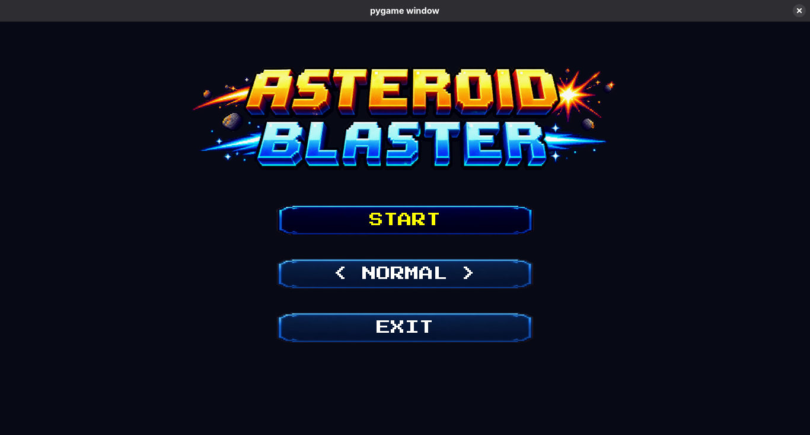
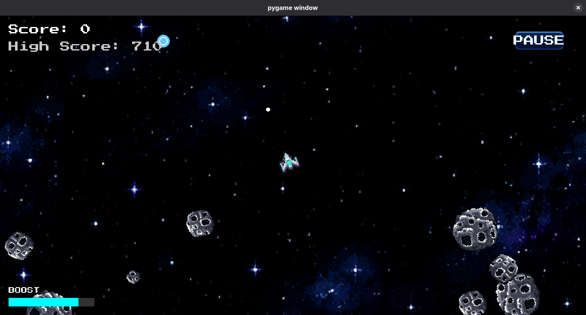

# Asteroid Blaster 🚀

A modern, highly-polished take on the classic arcade space shooter. Pilot your ship through an infinite, boundless universe, blast apart asteroids, and climb the leaderboards using an array of power-ups and boost mechanics.

<table>
  <tr>
    <td></td>
    <td></td>
  </tr>
</table>

## 🎮 Controls

| Action                      | Keybind                   |
| :-------------------------- | :------------------------ |
| **Thrust Forward/Backward** | `W` / `S`                 |
| **Rotate Ship**             | `A` / `D`                 |
| **Shoot**                   | `Left Click` or `ENTER`   |
| **Boost Speed**             | `SPACE` (Requires Energy) |
| **Pause Game**              | `ESC`                     |

## 🚀 How to Play

1. Make sure you have Python and `pygame` installed.
2. Clone or download this repository.
3. Run the game from your terminal:
   ```bash
   python src/main.py
   ```
4. Select your difficulty, hit START, and survive for as long as you can!

---

_Built with Python & Pygame._
